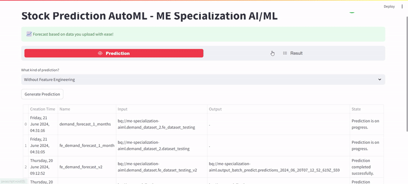

# Google Cloud End-to-End Machine Learning Using Black Friday Dataset to Predict Customer Purchase

## Overview:
In this project, we aim to predict product demand for a manufacturing company with footprints globally. We will follow all the steps of a Data Science lifecycle, from data collection to model deployment.
  
## WebApp: 
> Link: https://batch-prediction-fbhrrojzua-et.a.run.app
----

----

----
## Introduction
In term of product demands, it is a common things that a company provides thousands of products within dozens of product categories. There are also some central warehouses to ship products within the region it is responsible for. Since the products are manufactured in different locations all over the world, it normally takes more than one month to ship products via ocean to different central warehouses. If forecasts for each product in different central with reasonable accuracy for the monthly demand for month after next can be achieved, it would be beneficial to the company in multiple ways. Machine learning (ML) offers a solution to solve this problem, by enabling forecasting product demand, company could take first step ahead to distribute product evenly. In this project, a Product Demand dataset was analyzed using ML regression models, with the aim of predicting individual product demands. Powered by AutoML in Vertex AI and Time series Dense Encoder (TiDE) algorithm, regression model built with good performance values to predict product demans. This model holds significant promise for businesses looking to optimize their providing peoduct based on product demand and strategies during shipping product throughout warehouses of the company.

## System Architecture
The system architecture involves machine learning techniques applied to the Product Demand dataset to predict product demands using AutoML in Vertex AI and Time series Dense Encoder algorithm. The evaluation metrics used are root mean squared error (RMSE), Mean Absolute Error (MAE), and R-Squared. Data preprocessing steps include handling missing values, converting categorical features to numerical features, and normalizing numerical features. The cleaned data store in BigQuery and used for AutoML training and testing data. There's two types models in this case: 1) Model that used Feature Engineering; 2) Model that not used Feature Engineering. Models are trained and evaluated on the training set, and both models are deployed to a production environment to see the different performance between them.

## Dataset 
| Column ID |         Column Name        | Data type |           Description           | Masked |
|:---------:|:--------------------------:|:---------:|:-------------------------------:|--------|
|     0     |        Product_Code        |  object   |       Unique Id of Product      | True   |
|     1     |          Warehouse         |  object   |      Unique Id of Warehouse     | False  |
|     2     |      Product_Category      |  object   |       Category of Product       | False  |
|     3     |            Date            |  date     |   Date of Order Demand (Daily)  | True   |
|     4     |        Order_Demand        |  int64    |    Order Quantity of Product    | True   |

## Model Used
Regression AutoML Vertex AI with Time series Dense Encoder (TiDE)

## Evaluation and Analysis 
The both models built by Regression AutoML Vertex AI Model achieved performance with MAE, RMSE, and R-Squared metric evaluations mentioned below:

|    Model Type    |     MAE    |    RMSE   | R-Squared |
|:----------------:|:----------:|:---------:|:---------:|
|      With FE*    | 10.754,668 | 67.925.40 |   0.95    |
|    Without FE*   | 12.231,446 | 77.588,77 |   0.92    |

*FE = Feature Engineerings

The best performance model achieved by model which built with data with feature engineering, that could be seen by lower error rate than without feature engineering 

## Conclusion
The project explored four machine learning models to predict customer product demands. The regression AutoML model used to built best possible model with Time series Dense Encoder algorithm. The best model achieved model which built by data that processed by feature engineering first than the one which did not. This insight show us how efficient to use AutoML for create forecasting model of product demands and the impact of feature engineering for model performance.

Contact Information
For questions or support, please contact Dimmas Mulya at dimmas3010@gmail.com.

